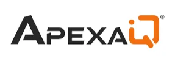
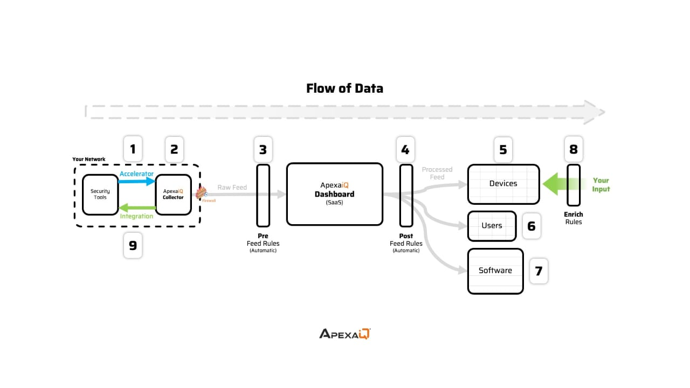
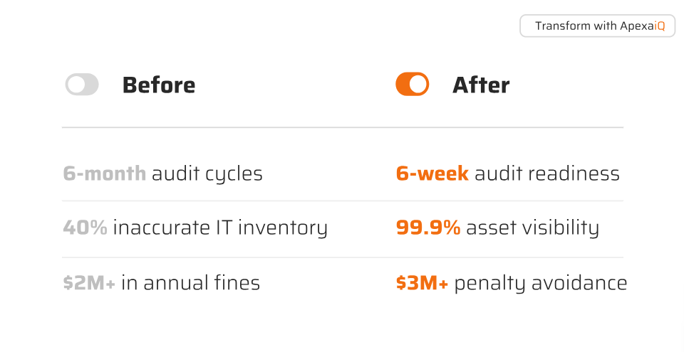
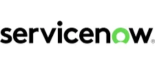
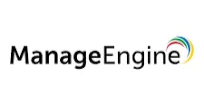
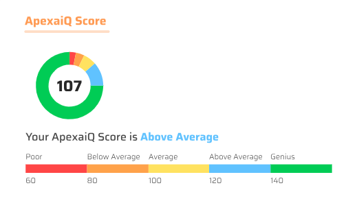
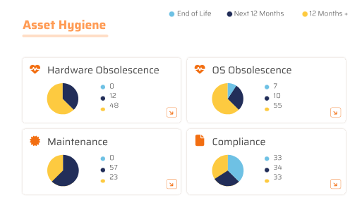

# ApexaiQ Week 01 Tasks Docs

Created by: Vikas More
Created time: September 22, 2025 1:00 PM
Category: Research
Last edited by: Vikas More
Last updated time: September 25, 2025 5:09 PM

# Week-01

# **Introduction to the ApexaiQ**

CEO & President of ApexaiQ - [Lokesh Aggarwal](https://www.linkedin.com/in/lokesh-aggarwal-5858252/)

1. ApexaiQ is the comprehensive asset inventory management platform that -

- Keep track of all assets
- delivers clean, trusted data
- empowers to find, fix, and report risks
- uncovers shadow IT

1. ApexaiQ turn chaos into actionable control

   

- Discover - See every asset , every gap ,every vulnerability instantly
- Categorizes - Group assets by types, security and owner for clear accountability
- Quantify - Measure business impact not just technical issues, so you invest efforts where matters
- Prioritize - Zero in on what truly needs attention today—no more chasing noise.
- Act - Fix what’s burning, monitor what can wait, and move at the speed of risk.
- Report - Prove your progress, close the loop, and never slide backwards.

1. ApexaiQ is a product-based company that sells its software as a service (SaaS).

1. ApexaiQ has -

- **Agentless Architecture** :means the software works without needing extra programs (“agents”) installed on every device. It collects data through accelerators and collectors.
- **Customizable Data Prioritization** :Customize insights to align with organization's unique needs and risk

1. **Flow of Data in ApexaiQ**

# What does ApexaiQ do? What industry problem does it solve?

A) **What does ApexaiQ do?**

- **ApexaIQ** is a **cloud-based, agentless IT Asset Management (ITAM) platform**.
- It **continuously discovers, monitors, and secures** all IT assets (devices, software, users, and cloud resources) in an organization.
- It provides a **real-time inventory** of assets, highlighting risks like vulnerabilities, outdated systems, and compliance issues.
- It helps companies **optimize IT operations, reduce costs, and improve security**.

---

B) **What industry problem does ApexaIQ solve?**

1. **Lack of Visibility**
   - Many organizations don’t have a clear picture of all their IT assets (on-prem, cloud, shadow IT).
   - ApexaIQ solves this by giving a **single source of truth** for all assets.
2. **Security Risks**
   - Unpatched software, outdated devices, and hidden vulnerabilities can lead to cyberattacks.
   - ApexaIQ **detects risks early** and helps fix them before attackers exploit them.
3. **Compliance Challenges**
   - Companies must follow laws and standards (HIPAA, ISO 27001, etc.).
   - ApexaIQ **ensures compliance** by tracking licensing, end-of-life systems, and regulatory gaps.
4. **High Operational Costs**
   - Without asset visibility, companies overspend on unused licenses or hardware.
   - ApexaIQ **optimizes resources**, reducing unnecessary costs.
5. **Manual & Complex IT Management**
   - Traditional ITAM tools require heavy manual effort and agents installed on devices.
   - ApexaIQ is **agentless and automated**, making deployment easy and fast.
6. **Simplify Audit Process**

   - Cuts audit preparation time by 75%, delivering continuous compliance, real-time visibility, and the confidence to drive business growth year-round.

   

# What is IT asset management and why companies need asset management software?

A) What is IT Asset Management (ITAM)?

- IT Asset Management is the process of **tracking and managing all IT assets** in a company.
- IT assets include **computers, laptops, servers, software, cloud services, and other devices**.
- ITAM helps companies **know what they have, where it is, and how it is being used**.
- It supports the **entire lifecycle of assets** — from purchase to use, maintenance, and disposal.

B) Why companies need IT asset management software

- **Better visibility** – It shows all assets in one place so IT teams know exactly what the company owns.
- **Security improvement** – Helps identify unpatched or unauthorized devices to reduce risks.
- **Compliance** – Ensures the company follows laws, regulations, and licensing rules.
- **Cost savings** – Avoids buying unnecessary hardware/software and manages licenses efficiently.
- **Operational efficiency** – Reduces manual tracking, audits, and errors by automating asset management.

# 3-5 competitors of ApexaiQ and how they are different from ApexaiQ Case studies.

1. **ServiceNow IT Asset Management**

- **Strengths:** Comprehensive ITSM platform integration, enterprise-grade scalability, deep workflow automation
- **Architecture:** Agent-based with cloud capabilities
- **Focus:** Full ITSM suite with ITAM as part of broader service management
- **Differentiation from ApexaIQ:** Unlike Lansweeper, which focuses on discovery and inventory, ServiceNow offers deep integration between ITAM and ITSM modules, allowing for real-time lifecycle tracking, ticket linking, change impact analysis.

2. **Lansweeper**

- **Strengths:** Strong network discovery capabilities, agentless scanning, detailed hardware/software inventory
- **Architecture:** Primarily agentless with some agent capabilities
- **Focus:** Asset discovery and inventory management
- **Differentiation from ApexaIQ:** Direct competitor in agentless discovery space, but ApexaIQ's advantage lies in automated data processing and vulnerability management integration

3. **ManageEngine AssetExplorer**

- **Strengths:** Comprehensive IT asset management solution that provides visibility into hardware and software assets. It's ideal for businesses looking for an affordable yet feature-rich ITAM solution
- **Architecture:** Traditional agent-based with web interface
- **Focus:** Cost-effective ITAM for small to medium enterprises
- **Differentiation from ApexaIQ:** More traditional approach vs. ApexaIQ's modern, automated intelligence platform

4. **Tanium**

- **Strengths:** Real-time platform for AI that delivers autonomous solutions, empowers the AI ecosystem, and enables organizations to mitigate risk and maintain the highest levels of operational confidence
- **Architecture:** Agent-based with real-time capabilities
- **Focus:** Endpoint management with strong security emphasis
- **Differentiation from ApexaIQ:** More security-focused vs. ApexaIQ's broader IT hygiene approach

5. **Device42**

- **Strengths:** Strong in data center asset management, dependency mapping, cloud integration
- **Architecture:** Agentless discovery with comprehensive API integrations
- **Focus:** Infrastructure discovery and dependency mapping
- **Differentiation from ApexaIQ:** More infrastructure-focused vs. ApexaIQ's holistic IT hygiene and security approach

# Document your findings and research on Cybersecurity.

1. **What is Cybersecurity?**

**Cybersecurity** is made up of **two parts: "Cyber" and "Security."**

- **Cyber** – Refers to the **digital world**, including:
  - Internet
  - Networks
  - Information & data
  - Applications & software
  - Digital devices (computers, smartphones, IoT devices)
- **Security** – Refers to the **protection of digital assets**, including:
  - **System security** – Protecting operating systems and devices
  - **Network security** – Protecting networks from unauthorized access or attacks
  - **Application security** – Securing software applications from vulnerabilities
  - **Information/data security** – Ensuring confidentiality, integrity, and availability of data

Cybersecurity is the practice of protecting computer systems, networks, data, and digital assets from **unauthorized access, damage, theft, or disruption**.

In simple words: **Cybersecurity = Protecting digital information and systems from attacks or misuse.**

---

2. **Why Cybersecurity Matters**

- **Data protection:** Prevents theft of sensitive information (personal, financial, healthcare, business).
- **Business continuity:** Reduces downtime from attacks and system failures.
- **Trust:** Builds customer and stakeholder confidence.

---

3. **Key Elements of Cybersecurity**

- 1. **Confidentiality**
     Only authorized people/systems can access sensitive information.
     Example: Encrypting patient data in hospitals.
- 2. **Integrity**
     Ensures information is accurate and not tampered with.
     Example: Protecting bank transaction records from alteration.
- 3. **Availability**
     Systems and data must be accessible when needed.
     Example: Ensuring an online shopping site is up 24/7.

Together, these form the **CIA Triad** — the foundation of cybersecurity.

---

4. **Types of Cybersecurity**

- **Network Security** – Protects networks from attacks (firewalls, IDS/IPS, VPNs).
- **Application Security** – Secures software against bugs, flaws, and vulnerabilities.
- **Endpoint Security** – Protects devices (laptops, phones) using antivirus, EDR.
- **Cloud Security** – Protects cloud apps and data (AWS, Azure, GCP).
- **Data Security** – Encryption, data masking, backups.
- **Identity & Access Management (IAM)** – Multi-factor authentication (MFA), role-based access.
- **Operational Security (OpSec)** – Policies and processes for secure day-to-day operations.
- **Disaster Recovery & Business Continuity** – Plans to recover quickly from cyberattacks or failures.

---

5. **Cyber Threats & Attacks**

- **Malware** – Viruses, worms, trojans.
- **Ransomware** – Locks/encrypts data until ransom is paid.
- **Phishing** – Tricking users into giving credentials.
- **Man-in-the-Middle (MITM)** – Intercepting communication between two parties.
- **SQL Injection / Code Injection** – Exploiting input fields to access databases.
- **Denial of Service (DoS/DDoS)** – Overloading systems to make them unavailable.
- **Zero-day Exploit** – Attacking before a vulnerability patch is available.
- **Insider Threats** – Employees misusing access.

---

# Study the following concepts:

## 1. ApexaiQ score

The **Apexa iQ Score** is a metric used by **ApexaIQ** to summarize the overall **health, security, and compliance status of IT assets** within an organization.

1. **Purpose:**
   - It gives a **single, easy-to-understand number** that reflects how well your IT assets are being managed, monitored, and secured.
2. **Factors it considers:**
   - **Asset visibility:** Are all devices, software, and cloud services properly tracked?
   - **Compliance:** Are assets following internal policies and external regulations?
   - **Security risks:** Are there vulnerabilities, outdated software, or unauthorized devices?
   - **Operational efficiency:** Are assets being used optimally without waste?
3. **Interpretation:**
   - **Higher score → Better:** Indicates most assets are secure, compliant, and well-managed.
   - **Lower score → Needs improvement:** Indicates gaps in asset visibility, security, or compliance.
4. **Use case:**
   - Helps IT and security teams **quickly assess risk** and **prioritize actions** to improve asset management.

## **2. IT Asset Management (ITAM)?**

IT Asset Management is the process of **tracking, managing, and optimizing all IT assets in a company**. IT assets include:

- **Hardware:** Computers, laptops, servers, networking devices, printers.
- **Software:** Applications, operating systems, licenses.
- **Cloud services & subscriptions:** SaaS tools, cloud storage, virtual machines.
- **Other devices:** IoT devices, mobile phones, or any connected equipment.

ITAM ensures that organizations know **what assets they have, where they are, how they are used, and when they need maintenance or replacement**.

---

**Why ITAM is Important for Companies**

- **Better visibility:** Gives a complete picture of all IT assets in the organization.
- **Security:** Helps identify unpatched, outdated, or unauthorized devices that could be a security risk.
- **Compliance:** Ensures software licensing, regulations, and internal policies are followed.
- **Cost savings:** Avoids unnecessary purchases, optimizes license usage, and tracks asset lifecycle.
- **Operational efficiency:** Reduces manual tracking and errors, and makes audits easier.

# 3. Asset Management Compliance?

Asset management compliance requires that organizations align their asset management practices with established business standards and industry-specific regulations. This form of compliance requires adherence to applicable laws, internal policies, and directives issued by regulatory bodies. Failure to maintain proper management of technology assets can lead to obsolescence and non-compliance, exposing the organization to vulnerabilities. However, by adhering to technology asset management compliance standards, organizations can unlock numerous advantages:

- **Protection of assets:** It assists organizations in safeguarding their assets against loss, damage, or misuse through effective asset tracking and security protocols.
- **Risk mitigation:** It significantly lowers the potential for financial losses, legal repercussions, and damage to the organization's reputation by implementing appropriate security enhancements.
- **Enhanced efficiency:** By adopting standardized processes, optimizing the lifecycle of assets, and improving resource allocation, it enhances the overall efficiency of asset management operations.
- **Greater transparency:** Compliance ensures increased transparency and accountability in managing assets, facilitated by comprehensive documentation, real-time reporting, and thorough audit trails.
- **Regulatory adherence:** It aids organizations in navigating the intricate web of regulatory obligations through tailored compliance strategies and adaptive change management, ensuring that they meet all necessary regulatory requirements.

## **4. Vulnerabilities**

- A **vulnerability** is a **weakness or flaw in a system, software, or device** that can be exploited by attackers to cause harm.
- Vulnerabilities can exist in **hardware, software, networks, or even processes**.

---

**Types of Vulnerabilities**

- **Software Vulnerabilities** – Bugs, outdated software, or misconfigurations in applications or operating systems.
- **Hardware Vulnerabilities** – Flaws in devices or firmware that can be exploited (e.g., unpatched routers).
- **Network Vulnerabilities** – Open ports, weak firewall rules, or insecure protocols.
- **Human/Process Vulnerabilities** – Weak passwords, phishing attacks, or poor security practices.

---

**Why Vulnerabilities Matter**

- Attackers can exploit vulnerabilities to **steal data, damage systems, or gain unauthorized access**.
- Unmanaged vulnerabilities increase **security risks** for organizations.
- Regularly identifying and fixing vulnerabilities is critical for **cybersecurity and compliance**.

---

**How Vulnerabilities are Managed**

- **Discovery:** Identify all assets and check for weaknesses.
- **Assessment:** Evaluate the risk level (high, medium, low).
- **Remediation:** Apply patches, configuration changes, or security controls.
- **Monitoring:** Continuously monitor assets to detect new vulnerabilities.

## **5. Obsolescence**

- **Obsolescence** refers to **IT assets, hardware, or software becoming outdated or no longer supported**.
- This can happen due to **new technology, software updates, or end-of-life (EOL) announcements** from vendors.

---

**Types of Obsolescence**

- **Hardware Obsolescence** – Devices like servers, laptops, or network equipment that are too old, slow, or incompatible with modern software.
- **Software Obsolescence** – Programs or applications that are no longer updated, patched, or supported by the vendor.

## **6. Compliance**

- **Compliance** means **following rules, laws, regulations, and internal policies** that apply to a company’s IT systems and assets.
- In IT, compliance ensures that hardware, software, and processes meet required **standards and legal obligations**.

## **7. IT Asset Maintenance**

- **Maintenance** refers to the **regular care, updates, and repairs** of IT assets (hardware, software, or network systems) to keep them **working efficiently and securely**.
- It ensures assets perform well, last longer, and remain compliant and secure.

## **8. End of Life, End of Support, End of Maintenance**

**1. End of Life**

- **Definition:** The point at which a product (hardware or software) is **no longer sold or produced** by the manufacturer.
- **Impact:**
  - The asset is considered **outdated**.
  - Organizations may need to **plan for replacement**.
- **Example:** A laptop model that is no longer available for purchase.

---

**2. End of Support**

- **Definition:** The point at which the manufacturer **stops providing technical support** for a product.
- **Impact:**
  - No help for troubleshooting or resolving issues.
  - Security vulnerabilities may not be fixed.
- **Example:** A software version where the vendor no longer provides patches or customer support.

---

**3. End of Maintenance**

- **Definition:** The point at which the manufacturer **stops releasing updates, bug fixes, or maintenance patches** for a product.
- **Impact:**
  - The asset becomes **riskier to use** as issues cannot be corrected.
  - May lead to **security, compliance, and operational problems**.
- **Example:** A server operating system that no longer receives updates from the vendor.

## **9. Asset Hygiene**

- **Asset Hygiene** refers to **keeping all IT assets clean, organized, and well-managed** throughout their lifecycle.
- It ensures that assets are **secure, up-to-date, and properly documented**, reducing risks and inefficiencies.

## **10. Crown Jewel**

- In IT security, a **Crown Jewel** refers to the **most critical and valuable digital assets** of an organization.
- These are the assets that, if **stolen, lost, or compromised**, would cause **major financial, operational, or reputational damage**.

---

**Examples of Crown Jewels**

- **Customer Data** – Personal information, payment details, or sensitive client records.
- **Intellectual Property** – Proprietary software, patents, designs, or trade secrets.
- **Critical Infrastructure** – Key servers, databases, or systems essential for business operations.
- **Financial Information** – Accounting systems, payroll data, or strategic plans.

## **11. Inventory**

- **Inventory** in IT refers to a **complete list of all hardware, software, and digital assets** that a company owns or uses.
- It is a **detailed record of IT assets**, including information such as:
  - Device type (laptop, server, printer)
  - Software name and version
  - Serial numbers or licenses
  - Location and assigned user
  - Status (active, obsolete, or retired)

## **12. NVD**

- **NVD** stands for **National Vulnerability Database**.
- It is a **U.S. government repository of publicly known cybersecurity vulnerabilities**.
- Managed by the **National Institute of Standards and Technology (NIST)**, it provides standardized information about software and hardware vulnerabilities.

---

**Purpose of NVD**

- **Centralized Information:**
  - Stores details about vulnerabilities, including severity, description, and references.
- **Standardized Scoring:**
  - Uses the **Common Vulnerability Scoring System (CVSS)** to rate the **severity of each vulnerability**.
- **Support for Security Tools:**
  - Helps IT teams and security tools **identify, assess, and prioritize vulnerabilities** in their systems.
- **Regulatory & Compliance Aid:**
  - Assists organizations in **meeting cybersecurity compliance requirements** by providing accurate vulnerability data.

## **13. Patch Management**

- **Patch Management** is the process of **updating software, applications, and systems** to fix bugs, close security vulnerabilities, or improve performance.
- A **patch** is a piece of code released by software vendors to **correct problems or vulnerabilities**.

---

**Why Patch Management is Important**

- **Security:**
  - Fixes vulnerabilities that hackers could exploit.
- **Performance:**
  - Improves software stability, speed, and functionality.
- **Compliance:**
  - Helps meet regulatory requirements by keeping systems updated and secure.
- **Prevent Downtime:**
  - Reduces crashes or failures caused by outdated software.

## **14. What is a Data Breach?**

- A **data breach** occurs when **sensitive, confidential, or protected data is accessed, stolen, or exposed** by an unauthorized person.
- Data can include **personal information, financial records, login credentials, intellectual property, or customer data**.

---

**Causes of Data Breaches**

- **Hacking & Cyberattacks:**
  - Attackers exploit vulnerabilities in systems to steal data.
- **Human Error:**
  - Accidental sharing of sensitive files or misconfigured databases.
- **Insider Threats:**
  - Employees or contractors intentionally or unintentionally leak data.
- **Lost or Stolen Devices:**
  - Laptops, phones, or USB drives containing sensitive information.
- **Malware & Phishing:**
  - Malicious software or deceptive emails trick users into revealing confidential information.

---

**Consequences of Data Breaches**

- **Financial Loss:** Fines, penalties, or theft of funds.
- **Reputation Damage:** Loss of customer trust and brand credibility.
- **Legal & Compliance Issues:** Violations of regulations like GDPR, HIPAA, or PCI-DSS.
- **Operational Disruption:** Systems may be shut down to investigate or contain the breach.

## 15. MSP

A Managed Services Provider (MSP) is **an outsourced third-party company that takes responsibility for the ongoing monitoring, maintenance, and management of a client's IT infrastructure and operations**. MSPs offer a wide range of services, such as network monitoring, cybersecurity, data backup, software updates, and application, infrastructure, and security management.

**How an MSP Works**

- **Outsourcing:**Instead of an in-house team, a client company outsources these responsibilities to an MSP.
- **Ongoing Support:**The MSP provides continuous support and active administration for the client's IT systems.
- **Service Delivery:**Services can be delivered on the client's premises, from the MSP's data center, or a third-party data center.

**Benefits of Using an MSP**

- **Proactive IT Management:**MSPs proactively monitor and manage systems to prevent issues before they become problems.
- **Reduced Costs:**By outsourcing, companies can often reduce costs associated with hiring and training in-house IT staff and purchasing equipment.
- **Access to Expertise:**Clients gain access to a team of specialized IT professionals with diverse skills and experience.
- **Focus on Core Business:**Outsourcing IT management allows companies to focus on their core business operations.

**Examples of MSP Services**

- Network monitoring and maintenance
- Cybersecurity and threat detection
- Data backup and disaster recovery
- Software updates and patching
- Cloud management and migration
- IT infrastructure management

## **16. Device Types**

- **Device Types** refer to the **different categories of hardware and endpoints** used in an organization’s IT environment.
- Knowing device types helps companies **track, manage, and secure all IT assets efficiently**.

---

**Common Device Types in IT**

- **Computers & Laptops**
  - Desktops, laptops, and workstations used by employees.
- **Servers**
  - Centralized machines that **store data, run applications, or manage networks**.
- **Mobile Devices**
  - Smartphones, tablets, and other portable devices used for work purposes.
- **Networking Devices**
  - Routers, switches, firewalls, and access points that **connect and protect the network**.
- **IoT Devices**
  - Smart devices connected to the network, like sensors, cameras, and smart appliances.
- **Peripherals & Accessories**
  - Printers, scanners, external drives, and other devices connected to computers or networks.
- **Virtual Devices**
  - Virtual machines (VMs) or cloud-based endpoints running on physical infrastructure.

## **17. True SaaS**

- **SaaS** stands for **Software as a Service**.
- **True SaaS** refers to software that is **completely cloud-based and delivered over the internet**, without requiring local installation or maintenance.
- It is **designed from the ground up for the cloud**, rather than being adapted from traditional on-premises software.

---

**Characteristics of True SaaS**

- **Multi-Tenant Architecture**
  - Multiple customers share the same software instance securely, while keeping their data separate.
- **Accessible Anywhere**
  - Can be used from any device with an internet connection.
- **Automatic Updates**
  - The provider handles updates and maintenance; users always have the latest version.
- **Scalable**
  - Easily adjusts resources and usage based on the customer’s needs.
- **Subscription-Based**
  - Paid via subscription (monthly or yearly), rather than one-time licensing.

## 18. Inbound/Outbound Integration

- **Integration** connects different software systems so they can **share data and work together** efficiently.

---

**1. Inbound Integration**

- **Definition:** When **data or information comes into a system from an external source**.
- **Purpose:** Allows the system to **receive updates, inputs, or notifications** automatically.
- **Example:**
  - A cloud-based IT asset management system receives **employee details from the HR software** automatically.
  - Alerts from security tools sent to the asset management platform.

---

**2. Outbound Integration**

- **Definition:** When **data or information is sent from a system to an external system**.
- **Purpose:** Enables the system to **share its data or trigger actions** in other platforms.
- **Example:**
  - IT asset management system sends **license compliance reports to a financial system**.
  - Vulnerability alerts are sent to a ticketing system like ServiceNow.

---

**Key Benefits of Inbound/Outbound Integration**

- **Automates data flow** between systems.
- **Reduces manual work** and errors.
- **Improves visibility** and decision-making.
- **Enhances security and compliance** by ensuring accurate data sharing.

---

**In simple words:**

- **Inbound integration** = **receiving data** from other systems.
- **Outbound integration** = **sending data** to other systems.

## **19. Compliance Standards - eg. CISA, CISO, HIPPA, ISO 27001**

- **Compliance standards** are **rules, guidelines, or frameworks** that organizations follow to ensure **data security, privacy, and operational integrity**.
- Following these standards helps companies **avoid legal penalties, protect data, and maintain trust**.

---

**Examples of Compliance Standards**

1. **CISA (Cybersecurity and Infrastructure Security Agency)**
   - A **U.S. government agency** that provides guidelines, best practices, and alerts to **protect critical infrastructure** from cyber threats.
2. **CISO (Chief Information Security Officer)**
   - Not a standard, but a **role responsible for implementing and maintaining compliance and cybersecurity policies** in an organization.
3. **HIPAA (Health Insurance Portability and Accountability Act)**
   - **U.S. law protecting sensitive patient health information**.
   - Organizations handling medical data must ensure **privacy, security, and proper handling of patient records**.
4. **ISO 27001 (International Organization for Standardization)**
   - An **international standard for information security management**.
   - Provides a framework for **managing risks, protecting data, and continuously improving security practices**.

---

**Why Compliance Standards Matter**

- **Legal Protection:** Avoid fines and lawsuits.
- **Data Security:** Protect sensitive and critical information.
- **Customer Trust:** Demonstrates that the company handles data responsibly.
- **Operational Excellence:** Establishes clear security policies and processes.

## **20. Perimeter**

- In cybersecurity, the **perimeter** refers to the **boundary between an organization’s internal network and the outside world (internet or external networks)**.
- It defines the **security boundary** where controls are applied to protect internal systems and data from external threats.

---

**Key Components of a Perimeter**

1. **Firewalls**
   - Control incoming and outgoing network traffic based on security rules.
2. **Network Gateways & Routers**
   - Direct traffic securely between internal and external networks.
3. **Intrusion Detection/Prevention Systems (IDS/IPS)**
   - Monitor and block suspicious activity at the network boundary.
4. **VPNs (Virtual Private Networks)**
   - Provide secure access to internal systems for remote users.

---

**Why Perimeter Security Matters**

- **Protects internal systems** from unauthorized access.
- **Reduces risk of attacks** such as hacking, malware, or data breaches.
- **Monitors and controls traffic** between the internal network and external sources.

## 21. ROI (Return on Investment)

- **ROI** stands for **Return on Investment**.
- It is a **measure of how much profit or benefit a company gets from an investment** compared to the cost of that investment.
- It helps organizations **evaluate whether a project, tool, or purchase is worth the money spent**.

---

## **22. KPI (Key Performance Indicator)**

- **KPI** stands for **Key Performance Indicator**.
- It is a **measurable value that shows how effectively a company or team is achieving its goals**.
- KPIs help organizations **track progress, make decisions, and improve performance**.

---

**Types of KPIs**

1. **Quantitative KPIs** – Measurable with numbers.
   - Example: Number of IT assets updated per month.
2. **Qualitative KPIs** – Measurable through quality or feedback.
   - Example: Employee satisfaction with IT services.
3. **Leading KPIs** – Predict future performance.
   - Example: Number of system vulnerabilities detected.
4. **Lagging KPIs** – Reflect past performance.
   - Example: Number of security incidents in the last quarter.

---

**Why KPIs Matter**

- **Track Progress:** Shows how well goals are being met.
- **Improve Decision-Making:** Helps managers focus on areas needing attention.
- **Increase Accountability:** Teams know what they are measured against.
- **Enhance Performance:** Encourages continuous improvement.

## **23. Auto-Remediation**

- **Auto-Remediation** is the **automatic detection and fixing of issues in IT systems or software** without human intervention.
- It helps organizations **reduce downtime, improve security, and maintain smooth operations**.

---

**How Auto-Remediation Works**

1. **Detection:**
   - Systems or monitoring tools identify problems such as vulnerabilities, misconfigurations, or errors.
2. **Analysis:**
   - The system evaluates the severity and impact of the issue.
3. **Automatic Action:**
   - Predefined rules or scripts **fix the problem automatically**.
   - Example actions:
     - Installing a missing software patch.
     - Resetting a misconfigured firewall rule.
     - Quarantining an infected device.
4. **Reporting:**
   - Generates logs or alerts to **inform IT teams** about the action taken.

---

**Benefits of Auto-Remediation**

- **Faster Response:** Issues are fixed immediately, reducing risk.
- **Reduces Human Error:** Automation ensures consistent and accurate fixes.
- **Saves Time & Resources:** IT teams can focus on strategic tasks instead of manual fixes.
- **Improves Security & Compliance:** Vulnerabilities and misconfigurations are addressed promptly.

## **24. Network Protocols**

- **Network Protocols** are **rules and standards that devices follow to communicate and exchange data over a network**.
- They ensure that data is **sent, received, and interpreted correctly** between computers, servers, and other networked devices.

---

**Common Network Protocols**

1. **HTTP / HTTPS (Hypertext Transfer Protocol / Secure)**
   - Used for **browsing websites**. HTTPS encrypts data for security.
2. **FTP (File Transfer Protocol)**
   - Used to **transfer files** between computers on a network.
3. **TCP/IP (Transmission Control Protocol / Internet Protocol)**
   - Fundamental protocol for **internet communication**, ensuring data is delivered correctly.
4. **SMTP ( Simple Mail Transfer Protocols)**
   - Used for **sending and receiving emails**.
5. **DNS (Domain Name System)**
   - Translates **website names into IP addresses** so computers can find them.
6. **DHCP (Dynamic Host Configuration Protocol)**
   - Automatically **assigns IP addresses** to devices on a network.

---

**Why Network Protocols Matter**

- **Enable Communication:** Devices can understand each other.
- **Ensure Data Accuracy:** Protocols handle errors and retransmissions.
- **Improve Security:** Some protocols (like HTTPS) encrypt data to prevent eavesdropping.
- **Standardization:** Allows different devices and systems to work together.

## **25. Due Diligence**

- **Due diligence** is the **careful investigation, review, or analysis** of a company, system, process, or investment **before making a decision**.
- In IT and cybersecurity, it often refers to **checking systems, software, and security practices** to ensure they meet standards and are risk-free.

---

**Why Due Diligence Matters**

1. **Risk Assessment:**
   - Identifies potential **security vulnerabilities, compliance issues, or operational risks**.
2. **Informed Decision-Making:**
   - Helps businesses decide whether to **buy, invest, or implement a system or software**.
3. **Compliance & Legal Protection:**
   - Ensures **regulatory requirements are met**, avoiding penalties or legal issues.
4. **Financial Security:**
   - Prevents losses from bad investments, security breaches, or non-compliant systems.

## **26. Role of ITAM in Zero Trust Security Models**

- **Zero Trust Security** means **never automatically trusting any device or user**, whether inside or outside the network. Every access request is verified before granting permissions.
- **IT Asset Management (ITAM)** plays a key role by **providing complete visibility and control over all IT assets**, which is critical for Zero Trust.

**How ITAM Supports Zero Trust:**

1. **Asset Discovery & Inventory**
   - ITAM identifies all devices, software, and users in the network to **ensure nothing is untracked**.
2. **Access Control**
   - Helps determine **who can access what resources** based on device type, user role, and compliance status.
3. **Vulnerability & Patch Management**
   - Ensures all devices are **updated and secure**, reducing potential attack points.
4. **Continuous Monitoring**
   - Provides ongoing insights into **device status, compliance, and security posture** to enforce Zero Trust principles.

## **27. Cyber Asset Attack Surface Management (CAASM)**

- **CAASM** is the practice of **discovering, mapping, and monitoring all IT assets to reduce the attack surface**.
- It integrates data from ITAM, security tools, and cloud environments to give **a complete view of potential entry points for attackers**.

**Benefits of CAASM:**

- **Comprehensive Visibility** – Identifies all assets, including shadow IT and cloud resources.
- **Risk Reduction** – Highlights vulnerabilities that attackers could exploit.
- **Improved Security Decisions** – Prioritizes high-risk assets for patching or protection.
- **Supports Zero Trust** – Helps enforce strict access and security policies based on asset risk.
